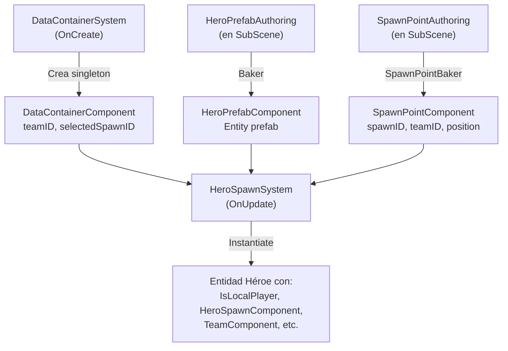

# Guía: Cómo Funciona el Spawn del Héroe

## Resumen del Flujo

El spawn del héroe utiliza un pipeline ECS (Entity Component System) donde varias piezas colaboran:



---

## 1. Piezas Necesarias en la Escena

### 1.1 SubScene (DotsWorld)

Toda la lógica ECS se bakea dentro de una **SubScene**. En `HeroTestCameraInputScene`, el GameObject **"DotsWorld"** tiene el componente `SubScene` apuntando a `Assets/Scenes/HeroTestInputScene/DotsWorld.unity`.

Dentro de esta SubScene se colocan:

| GameObject | Script Authoring | Función |
|---|---|---|
| `HeroPrefabAuthoring` | `HeroPrefabAuthoring` | Referencia al prefab ECS del héroe (`HeroEntity_Pure.prefab`) |
| `spawnPoint` (×N) | `SpawnPointAuthoring` | Define puntos de spawn con `spawnID`, `teamID`, posición |
| `markerAuth` | (Marker authoring) | Opcional, para debug visual |

### 1.2 Escena Principal (fuera de SubScene)

| GameObject | Función |
|---|---|
| `Directional Light` | Iluminación |
| `Main Camera Follow` | Cámara que sigue al héroe (prefab) |
| `visualRegistry` | Registro de prefabs visuales |
| `Terrain` | Terreno del mapa |
| `HUDController` | UI de salud/estamina |
| `Canvas` + `EventSystem` | Sistema de UI |

---

## 2. Archivos Clave del Pipeline

### 2.1 Prefab del Héroe

**Archivo:** `Assets/Prefabs/Hero/HeroEntity_Pure.prefab`

Este prefab tiene dos Authorings:

#### `HeroEntityAuthoring` → `HeroEntityBaker`
- **Ruta:** `Assets/Scripts/Hero/HeroEntity.Authoring.cs`
- Bakea todos estos componentes ECS:

| Componente ECS | Campos principales |
|---|---|
| `HeroLifeComponent` | `isAlive`, `deathTimer`, `respawnCooldown` |
| `HeroSpawnComponent` | `spawnId`, `spawnPosition`, `spawnRotation`, `hasSpawned`, `visualPrefabId` |
| `TeamComponent` | `value` (enum Team) |
| `HeroStatsComponent` | `baseSpeed`, `sprintMultiplier` |
| `StaminaComponent` | `maxStamina`, `currentStamina`, `regenRate`, `isExhausted` |
| `HeroHealthComponent` | `currentHealth`, `maxHealth` |
| `HeroSquadSelectionComponent` | `squadDataEntity`, `instanceId` (opcional) |
| `IsLocalPlayer` | Tag component (sin datos) |
| `HeroInputComponent` | Componente de input |

#### `HeroClassAuthoring` (segundo script)
- Referencia a un `classDefinition` ScriptableObject.

### 2.2 Referencia al Prefab

**Archivo:** `Assets/Scripts/Hero/HeroPrefab.Authoring.cs`

```csharp
public class HeroPrefabAuthoring : MonoBehaviour
{
    public GameObject heroPrefab; // ← Arrastra HeroEntity_Pure aquí
}
```

El `HeroPrefabBaker` convierte esto en un singleton `HeroPrefabComponent` con la entidad prefab.

### 2.3 Spawn Points

**Archivos:**
- `Assets/Scripts/Map/SpawnPoint.Authoring.cs` — MonoBehaviour
- `Assets/Scripts/Map/SpawnPointBaker.cs` — Convierte a `SpawnPointComponent`
- `Assets/Scripts/Map/SpawnPoint.Component.cs` — Componente ECS

```csharp
// SpawnPointAuthoring (MonoBehaviour en SubScene)
public int spawnID;    // ID único del punto
public int teamID;     // Equipo que puede usar este punto
public bool isActive;  // Si está habilitado
// La posición se toma del Transform automáticamente
```

### 2.4 DataContainer (Singleton de Configuración)

**Archivo:** `Assets/Scripts/Shared/DataContainer.System.cs`

Se crea automáticamente en `OnCreate()` del `DataContainerSystem`:

```csharp
new DataContainerComponent
{
    playerID = 1,
    teamID = 1,           // ← Debe coincidir con el teamID del SpawnPoint
    selectedSpawnID = 1,   // ← Debe coincidir con el spawnID del SpawnPoint
    isReady = false
}
```

> [!IMPORTANT]
> El `teamID` y `selectedSpawnID` del `DataContainerComponent` deben coincidir con al menos un `SpawnPointComponent` en la SubScene, o el héroe no se spawneará.

---

## 3. Sistema de Spawn: `HeroSpawnSystem`

**Archivo:** `Assets/Scripts/Hero/Systems/HeroSpawn.System.cs`

### Flujo de Ejecución

1. **Espera 1 segundo** y verifica cada 30 frames (evita condiciones de carrera).
2. **Verifica si existe héroe** buscando entidades con `IsLocalPlayer`.
3. **Si no existe héroe**, intenta spawnearlo:
   - Obtiene `HeroPrefabComponent` (singleton) → prefab de la entidad.
   - Obtiene `DataContainerComponent` (singleton) → `selectedSpawnID` y `teamID`.
   - Busca un `SpawnPointComponent` que coincida con `spawnID == selectedSpawnID && teamID == dataContainer.teamID && isActive`.
   - Si no encuentra match exacto, busca cualquier SpawnPoint del mismo `teamID`.
   - **Instancia** la entidad con `EntityManager.Instantiate(heroPrefab.prefab)`.
   - Ajusta la posición Y al terreno con `FormationPositionCalculator.calculateTerraindHeight()`.
   - Marca `hasSpawned = true`.
4. **Si ya existe héroe** pero `hasSpawned == false`, lo reposiciona en el spawn point correcto.

---

## 4. Guía Paso a Paso: Agregar Spawn en una Nueva Escena

### Paso 1: Crear la SubScene

1. Crea una nueva escena Unity (ej: `MiMapa_SubScene.unity`) en la carpeta de tu mapa.
2. En tu escena principal, crea un **GameObject vacío** llamado `DotsWorld`.
3. Añádele el componente **SubScene** y arrastra la escena del paso 1 como `_SceneAsset`.
4. Activa `AutoLoadScene = true`.

### Paso 2: Configurar SpawnPoints en la SubScene

Dentro de la SubScene, crea GameObjects con `SpawnPointAuthoring`:

```
SubScene/
├── SpawnPoint_Team1_A    (spawnID=1, teamID=1, isActive=true)
├── SpawnPoint_Team1_B    (spawnID=2, teamID=1, isActive=true)
├── SpawnPoint_Team2_A    (spawnID=1, teamID=2, isActive=true)
└── SpawnPoint_Team2_B    (spawnID=2, teamID=2, isActive=true)
```

- Posiciona cada GameObject donde quieras que aparezca el héroe.
- El `spawnID` identifica el punto; el `teamID` filtra por equipo.

### Paso 3: Añadir HeroPrefabAuthoring en la SubScene

1. Arrastra el prefab `Assets/Prefabs/Map/HeroPrefabAuthoring.prefab` a la SubScene.
2. En el inspector, verifica que `heroPrefab` apunta a `Assets/Prefabs/Hero/HeroEntity_Pure.prefab`.

### Paso 4: Verificar DataContainerSystem

El singleton se crea automáticamente con valores por defecto (`teamID=1`, `selectedSpawnID=1`). Si necesitas valores distintos, modifícalos en:
- `Assets/Scripts/Shared/DataContainer.System.cs` → método `OnCreate()` 
- O a través del flujo normal de UI (selección de spawn en preparación de batalla).

### Paso 5: Escena Principal (fuera de SubScene)

Asegúrate de tener en la escena principal:

- **Terrain** — para que `calculateTerraindHeight()` funcione.
- **Main Camera** — con el script de seguimiento del héroe.
- **visualRegistry** — para que el sistema de renderizado híbrido cree el visual del héroe.

### Paso 6: Play & Verificar

Al darle Play:
1. `DataContainerSystem.OnCreate()` crea el singleton con `selectedSpawnID=1, teamID=1`.
2. Los `SpawnPointAuthoring` se bakean a entidades `SpawnPointComponent`.
3. `HeroPrefabAuthoring` se bakea a singleton `HeroPrefabComponent`.
4. Después de ~1 segundo, `HeroSpawnSystem` detecta que no hay héroe con `IsLocalPlayer`.
5. Busca el SpawnPoint con `spawnID=1, teamID=1`.
6. Instancia `HeroEntity_Pure` en esa posición, ajustada al terreno.
7. El sistema visual crea el modelo 3D del héroe automáticamente.

---

## 5. Ejemplo de Referencia: HeroTestCameraInputScene

### Jerarquía de la Escena

```
HeroTestCameraInputScene (escena principal)
├── Directional Light
├── Main Camera Follow (prefab)
├── visualRegistry (prefab)
├── DotsWorld ← SubScene apuntando a HeroTestInputScene/DotsWorld.unity
├── HUDController
├── Canvas
│   └── HUD
│       └── ScreenSpace
│           ├── Center buttom (HealthBar, StaminaBar)
│           └── Right Top (Velocidad text)
├── EventSystem
├── Block_02 (prefab decorativo)
└── Terrain
```

### Contenido de la SubScene (DotsWorld.unity)

```
DotsWorld.unity
├── HeroPrefabAuthoring     → heroPrefab = HeroEntity_Pure.prefab
├── spawnPoint              → spawnID=1, teamID=1 (default), pos=(-2.31, 0, 31.5)
├── spawnPoint (1)          → spawnID=2, teamID=1, pos=(30, 0.5, -30)
└── markerAuth              → Prefab de marker visual
```

---

## 6. Troubleshooting

| Problema | Causa Probable | Solución |
|---|---|---|
| Héroe no aparece | No hay `HeroPrefabAuthoring` en SubScene | Añadir prefab con referencia a `HeroEntity_Pure` |
| Héroe no aparece | `DataContainer.teamID` ≠ `SpawnPoint.teamID` | Verificar que los teamIDs coincidan |
| Héroe aparece bajo el terreno | `calculateTerraindHeight()` no encuentra Terrain | Asegurar que hay un Terrain en la escena principal |
| Héroe aparece en posición incorrecta | `selectedSpawnID` no coincide con ningún `spawnID` | El sistema usa fallback: primer SpawnPoint del mismo equipo |
| Spawn tarda ~1 segundo | Comportamiento esperado | `HeroSpawnSystem` espera `ElapsedTime > 1.0f` intencionalmente |
