# Arquitectura de ScriptableObjects: ItemEffects, StatsGenerator y DialogEffects

## 📋 Índice
1. [Introducción](#introducción)
2. [Arquitectura General](#arquitectura-general)
3. [Sistema ItemEffect](#sistema-itemeffect)
4. [Sistema ItemStatGenerator](#sistema-itemstatgenerator)
5. [Sistema DialogueEffect](#sistema-dialogueeffect)
6. [Integración y Flujo de Datos](#integración-y-flujo-de-datos)
7. [Patrones de Diseño](#patrones-de-diseño)
8. [Guía de Uso](#guía-de-uso)
9. [Ejemplos Prácticos](#ejemplos-prácticos)
10. [Troubleshooting](#troubleshooting)

---

## 🎯 Introducción

Esta arquitectura implementa un sistema modular basado en **ScriptableObjects** de Unity para manejar efectos de ítems, generación de stats y efectos de diálogo. El diseño permite crear comportamientos complejos sin modificar código, utilizando únicamente assets configurables desde el Editor de Unity.

### ¿Por qué ScriptableObjects?

- **Modularidad**: Cada efecto/generador es independiente
- **Extensibilidad**: Fácil agregar nuevos tipos sin modificar código existente  
- **Reutilización**: Los assets se pueden usar en múltiples contextos
- **Editor Integration**: Configuración visual desde Unity Editor
- **Serialización**: Unity maneja automáticamente la persistencia
- **Performance**: Se cargan una vez y se reutilizan
- **Type Safety**: Fuertemente tipado con validaciones

---

## 🏗️ Arquitectura General

La arquitectura sigue el **patrón Strategy** usando ScriptableObjects como estrategias concretas. Cada sistema tiene:

```
Sistema Base (Abstracto)
├── Clase Base ScriptableObject
├── Métodos Abstractos (deben implementarse)
├── Métodos Virtuales (implementación opcional)
└── Implementaciones Concretas
    ├── Efecto/Generador Tipo A
    ├── Efecto/Generador Tipo B
    └── ...
```

### Flujo General de Ejecución

```mermaid
graph TD
    A[Asset ScriptableObject] --> B[Sistema de Ejecución]
    B --> C[Validación CanExecute]
    C --> D{Válido?}
    D -->|Sí| E[Execute]
    D -->|No| F[Cancelar]
    E --> G[OnEffectExecuted]
    G --> H[Logging/Eventos]
```



---

## 📦 Sistema ItemEffect

### 🎯 Propósito
Maneja efectos aplicables por ítems consumibles (pociones, pergaminos, etc.)

### 📁 Estructura de Archivos
```
Assets/Scripts/Data/Items/
├── ItemEffect.cs (Clase base abstracta)
├── ItemDatabase.cs
├── Item.Data.cs
└── StatRange.cs

Assets/Scripts/Inventory/
├── ItemsEffects/
│   ├── CurrencyEffect.cs
│   └── EquipmentGrantEffect.cs
└── Services/
    └── ItemEffectSystem.cs
```

### 🔧 Clase Base: ItemEffect

```csharp
namespace Data.Items
{
    public abstract class ItemEffect : ScriptableObject
    {
        [Header("Effect Info")]
        [SerializeField] protected string effectId;
        [SerializeField] protected string displayName;
        [TextArea(2, 4)]
        [SerializeField] protected string description;
        [SerializeField] protected Sprite effectIcon;

        // ===== PROPIEDADES PÚBLICAS =====
        public string EffectId => effectId;
        public string DisplayName => displayName;
        public string Description => description;
        public Sprite EffectIcon => effectIcon;

        // ===== MÉTODOS ABSTRACTOS (OBLIGATORIOS) =====
        /// <summary>
        /// Ejecuta el efecto sobre el héroe
        /// </summary>
        public abstract bool Execute(HeroData hero, int quantity = 1);
        
        /// <summary>
        /// Descripción para mostrar en tooltips
        /// </summary>
        public abstract string GetPreviewText(int quantity = 1);

        // ===== MÉTODOS VIRTUALES (OPCIONALES) =====
        /// <summary>
        /// Verifica si el efecto se puede ejecutar
        /// </summary>
        public virtual bool CanExecute(HeroData hero) => hero != null;
        
        /// <summary>
        /// Prioridad de ejecución (mayor = primero)
        /// </summary>
        public virtual int GetExecutionPriority() => 0;

        // ===== MÉTODOS PROTEGIDOS =====
        protected virtual void OnEffectExecuted(HeroData hero, int quantity)
        {
            Debug.Log($"[ItemEffect] {DisplayName} executed on {hero.heroName}");
        }

        protected virtual void OnValidate()
        {
            if (string.IsNullOrEmpty(effectId))
                effectId = name;
        }
    }
}
```

### 🎯 Implementaciones Concretas

#### 1. CurrencyEffect
**Propósito**: Otorga monedas al héroe

```csharp
[CreateAssetMenu(fileName = "CurrencyEffect", menuName = "Items/Effects/Currency")]
public class CurrencyEffect : ItemEffect
{
    [Header("Currency Settings")]
    [SerializeField] private CurrencyType currencyType = CurrencyType.Gold;
    [SerializeField] private IntRange currencyAmount = new IntRange(10, 50);
    
    [Header("Validation")]
    [SerializeField] private bool hasMaximumLimit = false;
    [SerializeField] private int maximumCurrencyLimit = 999999;

    public override bool Execute(HeroData hero, int quantity = 1)
    {
        // Generar cantidad aleatoria
        int totalAmount = 0;
        for (int i = 0; i < quantity; i++)
            totalAmount += currencyAmount.GetRandomValue();
        
        // Aplicar límites
        if (hasMaximumLimit)
        {
            int current = GetCurrentCurrencyAmount(hero);
            totalAmount = Mathf.Min(totalAmount, maximumCurrencyLimit - current);
        }
        
        // Añadir al héroe
        return AddCurrencyToHero(hero, totalAmount);
    }
    
    public override string GetPreviewText(int quantity = 1) =>
        $"+{currencyAmount.min * quantity}-{currencyAmount.max * quantity} {currencyType}";
}
```

#### 2. EquipmentGrantEffect
**Propósito**: Otorga equipment específico

```csharp
[CreateAssetMenu(fileName = "EquipmentGrantEffect", menuName = "Items/Effects/Equipment Grant")]
public class EquipmentGrantEffect : ItemEffect
{
    [Header("Equipment Settings")]
    [SerializeField] private string targetItemId;
    [SerializeField] private bool allowDuplicates = true;

    public override bool Execute(HeroData hero, int quantity = 1)
    {
        // Validar item existe
        var itemData = InventoryUtils.GetItemData(targetItemId);
        if (itemData?.IsEquipment != true) return false;
        
        // Crear instancias
        for (int i = 0; i < quantity; i++)
        {
            var equipment = ItemInstanceService.CreateItem(targetItemId, 1);
            if (!InventoryManager.AddItem(targetItemId, 1))
                return false;
        }
        
        return true;
    }
}
```

### ⚙️ Sistema de Ejecución: ItemEffectSystem

```csharp
public static class ItemEffectSystem
{
    public static bool UseConsumableItem(InventoryItem item, HeroData hero)
    {
        // 1. Validaciones
        var protoItem = InventoryUtils.GetItemData(item.itemId);
        if (!protoItem.IsConsumable) return false;
        
        // 2. Verificar todos los efectos
        foreach (var effect in protoItem.effects)
            if (!effect.CanExecute(hero)) return false;
        
        // 3. Ordenar por prioridad
        var sortedEffects = protoItem.effects
            .OrderByDescending(e => e.GetExecutionPriority());
        
        // 4. Ejecutar todos
        bool allSucceeded = true;
        foreach (var effect in sortedEffects)
        {
            if (!effect.Execute(hero, 1))
            {
                allSucceeded = false;
                break;
            }
        }
        
        return allSucceeded;
    }
}
```

### 🔗 Integración con ItemData

```csharp
[Serializable]
public class ItemData
{
    // Para equipment
    public ItemStatGenerator statGenerator; // null para consumibles
    
    // Para consumibles  
    public ItemEffect[] effects; // null para equipment
    
    // Propiedades de conveniencia
    public bool IsEquipment => statGenerator != null;
    public bool IsConsumable => effects != null && effects.Length > 0;
}
```

---

## 📈 Sistema ItemStatGenerator

### 🎯 Propósito
Genera stats aleatorios para equipment (armas, armaduras)

### 📁 Estructura de Archivos
```
Assets/Scripts/Data/Items/
├── ItemStatGenerator.cs (Clase base)
└── StatRange.cs (Rangos de valores)

Assets/Scripts/Inventory/statsGenerators/
├── BasicWeaponStatGenerator.cs
└── BasicArmorStatGenerator.cs
```

### 🔧 Clase Base: ItemStatGenerator

```csharp
namespace Data.Items
{
    public abstract class ItemStatGenerator : ScriptableObject
    {
        [Header("Generator Info")]
        [SerializeField] protected string generatorId;
        [SerializeField] protected string displayName;
        [SerializeField] protected string description;

        // ===== PROPIEDADES =====
        public string GeneratorId => generatorId;
        public string DisplayName => displayName;
        public string Description => description;

        // ===== MÉTODOS ABSTRACTOS =====
        /// <summary>
        /// Genera diccionario de stats aleatorios
        /// </summary>
        public abstract Dictionary<string, float> GenerateStats();
        
        /// <summary>
        /// Preview de stats para mostrar en editor
        /// </summary>
        public abstract string GetStatsPreview();
        
        /// <summary>
        /// Lista de nombres de stats que genera
        /// </summary>
        public abstract List<string> GetStatNames();

        // ===== MÉTODOS VIRTUALES =====
        public virtual bool IsValid() =>
            !string.IsNullOrEmpty(generatorId) && !string.IsNullOrEmpty(displayName);
            
        public virtual float GetStatValue(string statName)
        {
            var stats = GenerateStats();
            return stats.GetValueOrDefault(statName, 0f);
        }
    }
}
```

### 🏹 Implementación: BasicWeaponStatGenerator

```csharp
[CreateAssetMenu(fileName = "BasicWeaponStatGenerator", 
                 menuName = "Items/Stat Generators/BasicWeapon")]
public class BasicWeaponStatGenerator : ItemStatGenerator
{
    [Header("Damage Stats")]
    [SerializeField] private FloatRange piercingDamage = new FloatRange(8f, 15f);
    [SerializeField] private FloatRange slashingDamage = new FloatRange(10f, 18f);
    [SerializeField] private FloatRange bluntDamage = new FloatRange(12f, 20f);
    
    [Header("Penetration Stats")]
    [SerializeField] private FloatRange piercingPenetration = new FloatRange(2f, 8f);
    [SerializeField] private FloatRange slashingPenetration = new FloatRange(1f, 6f);
    [SerializeField] private FloatRange bluntPenetration = new FloatRange(3f, 10f);

    [Header("Basic Stats")]
    [SerializeField] private FloatRange strength = new FloatRange(10f, 20f);
    [SerializeField] private FloatRange dexterity = new FloatRange(10f, 20f);

    [Header("Generation Settings")]
    [SerializeField] private bool allowZeroValues = false;

    public override Dictionary<string, float> GenerateStats()
    {
        var stats = new Dictionary<string, float>
        {
            ["PiercingDamage"] = RoundToInt(piercingDamage.GetRandomValue()),
            ["SlashingDamage"] = RoundToInt(slashingDamage.GetRandomValue()),
            ["BluntDamage"] = RoundToInt(bluntDamage.GetRandomValue()),
            ["PiercingPenetration"] = RoundToInt(piercingPenetration.GetRandomValue()),
            ["SlashingPenetration"] = RoundToInt(slashingPenetration.GetRandomValue()),
            ["BluntPenetration"] = RoundToInt(bluntPenetration.GetRandomValue()),
            ["Strength"] = RoundToInt(strength.GetRandomValue()),
            ["Dexterity"] = RoundToInt(dexterity.GetRandomValue())
        };

        if (!allowZeroValues)
            ValidateMinimumValues(stats);
            
        return stats;
    }

    public override string GetStatsPreview() =>
        $"Damage: P({piercingDamage}), S({slashingDamage}), B({bluntDamage})\n" +
        $"Penetration: P({piercingPenetration}), S({slashingPenetration}), B({bluntPenetration})\n" +
        $"Attributes: STR({strength}), DEX({dexterity})";

    public override List<string> GetStatNames() => new List<string>
    {
        "PiercingDamage", "SlashingDamage", "BluntDamage",
        "PiercingPenetration", "SlashingPenetration", "BluntPenetration",
        "Strength", "Dexterity"
    };
}
```

### 🛡️ Implementación: BasicArmorStatGenerator

```csharp
[CreateAssetMenu(fileName = "BasicArmorStatGenerator", 
                 menuName = "Items/Stat Generators/BasicArmor")]
public class BasicArmorStatGenerator : ItemStatGenerator
{
    [Header("Defense Stats")]
    [SerializeField] private FloatRange piercingDefense = new FloatRange(8f, 15f);
    [SerializeField] private FloatRange slashingDefense = new FloatRange(10f, 18f);
    [SerializeField] private FloatRange bluntDefense = new FloatRange(12f, 20f);
    
    [Header("Basic Stats")]
    [SerializeField] private FloatRange health = new FloatRange(50f, 100f);
    [SerializeField] private FloatRange armor = new FloatRange(30f, 60f);
    [SerializeField] private FloatRange vitality = new FloatRange(30f, 60f);

    public override Dictionary<string, float> GenerateStats() => new Dictionary<string, float>
    {
        ["PiercingDefense"] = RoundToInt(piercingDefense.GetRandomValue()),
        ["SlashingDefense"] = RoundToInt(slashingDefense.GetRandomValue()),
        ["BluntDefense"] = RoundToInt(bluntDefense.GetRandomValue()),
        ["Health"] = RoundToInt(health.GetRandomValue()),
        ["Armor"] = RoundToInt(armor.GetRandomValue()),
        ["Vitality"] = RoundToInt(vitality.GetRandomValue())
    };

    public override List<string> GetStatNames() => new List<string>
    {
        "PiercingDefense", "SlashingDefense", "BluntDefense",
        "Health", "Armor", "Vitality"
    };
}
```

### 🔧 Rangos de Valores: StatRange.cs

```csharp
namespace Data.Items
{
    [Serializable]
    public struct FloatRange
    {
        [SerializeField] public float min;
        [SerializeField] public float max;

        public FloatRange(float min, float max)
        {
            this.min = min;
            this.max = max;
        }

        public float GetRandomValue() => UnityEngine.Random.Range(min, max);
        public bool IsValid => min <= max;
        public override string ToString() => $"{min:F1}-{max:F1}";
    }

    [Serializable]
    public struct IntRange
    {
        [SerializeField] public int min;
        [SerializeField] public int max;

        public int GetRandomValue() => UnityEngine.Random.Range(min, max + 1);
        public bool IsValid => min <= max;
        public override string ToString() => $"{min}-{max}";
    }
}
```

---

## 💬 Sistema DialogueEffect

### 🎯 Propósito
Maneja efectos ejecutables durante diálogos con NPCs

### 📁 Estructura de Archivos
```
Assets/Scripts/Dialogue/
├── Effects/
│   ├── DialogueEffect.cs (Base)
│   ├── AddItemDialogueEffect.cs
│   ├── GiveExperienceDialogueEffect.cs
│   └── UnlockSquadDialogueEffect.cs
├── Systems/
│   ├── DialogueEffectSystem.cs
│   └── DialogueEffectDatabase.cs
├── NpcDialogueData.cs
└── DialogOption.Type.cs
```

### 🔧 Clase Base: DialogueEffect

```csharp
namespace ConquestTactics.Dialogue
{
    public abstract class DialogueEffect : ScriptableObject
    {
        [Header("Effect Info")]
        [SerializeField] protected string effectId;
        [SerializeField] protected string displayName;
        [SerializeField] protected string description;
        [SerializeField] protected Sprite effectIcon;

        // ===== PROPIEDADES =====
        public string EffectId => effectId;
        public string DisplayName => displayName;
        public string Description => description;
        public Sprite EffectIcon => effectIcon;

        // ===== MÉTODOS ABSTRACTOS =====
        /// <summary>
        /// Ejecuta el efecto de diálogo
        /// </summary>
        public abstract bool Execute(HeroData hero, string npcId = null, 
                                   DialogueParameters parameters = null);
        
        /// <summary>
        /// Descripción para logs/tooltips
        /// </summary>
        public abstract string GetPreviewText();

        // ===== MÉTODOS VIRTUALES =====
        public virtual bool CanExecute(HeroData hero, string npcId = null) => hero != null;
        public virtual int GetExecutionPriority() => 0;

        protected virtual void OnEffectExecuted(HeroData hero, string npcId)
        {
            Debug.Log($"[DialogueEffect] {DisplayName} executed on {hero.heroName} by {npcId}");
        }
    }
}
```

### 🎒 Implementación: AddItemDialogueEffect

```csharp
[CreateAssetMenu(fileName = "AddItemDialogueEffect", 
                 menuName = "NPC/Dialogue/Effects/Add Item")]
public class AddItemDialogueEffect : DialogueEffect
{
    [Header("Item Settings")]
    [SerializeField] private string itemId;
    [SerializeField] private int quantity = 1;
    [SerializeField] private bool showNotification = true;
    [SerializeField] private string customMessage;

    public override bool Execute(HeroData hero, string npcId = null, 
                               DialogueParameters parameters = null)
    {
        if (!CanExecute(hero, npcId)) return false;

        // Los parámetros pueden sobrescribir valores por defecto
        string targetItemId = !string.IsNullOrEmpty(parameters?.stringParameter) 
            ? parameters.stringParameter : itemId;
        int targetQuantity = parameters?.intParameter > 0 
            ? parameters.intParameter : quantity;

        if (string.IsNullOrEmpty(targetItemId)) return false;

        bool success = InventoryManager.AddItem(targetItemId, targetQuantity);
        
        if (success && showNotification)
        {
            string message = !string.IsNullOrEmpty(customMessage) 
                ? customMessage 
                : $"Received {targetQuantity}x {targetItemId}";
            Debug.Log($"[Dialogue] {message}");
        }

        return success;
    }

    public override string GetPreviewText() => $"Add {quantity}x {itemId} to inventory";
    
    public override bool CanExecute(HeroData hero, string npcId = null) =>
        base.CanExecute(hero, npcId) && InventoryManager.HasSpace();
}
```

### 📊 Implementación: GiveExperienceDialogueEffect

```csharp
[CreateAssetMenu(fileName = "GiveExperienceDialogueEffect", 
                 menuName = "NPC/Dialogue/Effects/Give Experience")]
public class GiveExperienceDialogueEffect : DialogueEffect
{
    [Header("Experience Settings")]
    [SerializeField] private int experienceAmount = 100;
    [SerializeField] private bool showNotification = true;
    [SerializeField] private string customMessage;

    public override bool Execute(HeroData hero, string npcId = null, 
                               DialogueParameters parameters = null)
    {
        if (!CanExecute(hero, npcId)) return false;

        int targetExperience = parameters?.intParameter ?? experienceAmount;
        if (targetExperience <= 0) return false;

        hero.currentXP += targetExperience;

        if (showNotification)
        {
            string message = !string.IsNullOrEmpty(customMessage) 
                ? customMessage 
                : $"Gained {targetExperience} experience";
            Debug.Log($"[Dialogue] {message}");
        }

        OnEffectExecuted(hero, npcId);
        return true;
    }

    public override string GetPreviewText() => $"Give {experienceAmount} experience";
    public override int GetExecutionPriority() => 5; // Prioridad media-alta
}
```

### 🏪 Implementación: UnlockSquadDialogueEffect

```csharp
[CreateAssetMenu(fileName = "UnlockSquadDialogueEffect", 
                 menuName = "NPC/Dialogue/Effects/Unlock Squad")]
public class UnlockSquadDialogueEffect : DialogueEffect
{
    [Header("Squad Settings")]
    [SerializeField] private string squadId;
    [SerializeField] private bool showNotification = true;
    [SerializeField] private string customMessage;

    public override bool Execute(HeroData hero, string npcId = null, 
                               DialogueParameters parameters = null)
    {
        string targetSquadId = parameters?.stringParameter ?? squadId;
        if (string.IsNullOrEmpty(targetSquadId)) return false;

        // Verificar si ya está desbloqueado
        if (hero.availableSquads.Contains(targetSquadId))
        {
            Debug.LogWarning($"Squad {targetSquadId} already unlocked");
            return false;
        }

        hero.availableSquads.Add(targetSquadId);
        return true;
    }

    public override bool CanExecute(HeroData hero, string npcId = null) =>
        base.CanExecute(hero, npcId) && !hero.availableSquads.Contains(squadId);

    public override int GetExecutionPriority() => 10; // Alta prioridad
}
```

### 📋 Parámetros de Diálogo

```csharp
[System.Serializable]
public class DialogueParameters
{
    public string stringParameter;   // Para IDs de items, nombres, etc.
    public int intParameter;         // Para cantidades, experiencia, etc.
    public float floatParameter;     // Para valores decimales
    public bool boolParameter;       // Para flags booleanos
}
```

### ⚙️ Sistema de Ejecución: DialogueEffectSystem

```csharp
public static class DialogueEffectSystem
{
    /// <summary>
    /// Ejecuta efectos por sus IDs
    /// </summary>
    public static bool ExecuteDialogueEffects(string[] effectIds, HeroData hero, 
                                            string npcId = null, 
                                            DialogueParameters parameters = null)
    {
        if (effectIds?.Length == 0) return true;

        // Resolver efectos desde la base de datos
        var effects = DialogueEffectDatabase.GetEffects(effectIds);
        return ExecuteDialogueEffects(effects, hero, npcId, parameters);
    }

    /// <summary>
    /// Ejecuta lista de efectos
    /// </summary>
    public static bool ExecuteDialogueEffects(DialogueEffect[] effects, HeroData hero, 
                                            string npcId = null,
                                            DialogueParameters parameters = null)
    {
        if (effects?.Length == 0) return true;
        if (hero == null) return false;

        // Validar que todos se pueden ejecutar
        foreach (var effect in effects)
            if (effect != null && !effect.CanExecute(hero, npcId))
                return false;

        // Ordenar por prioridad y ejecutar
        var sortedEffects = effects
            .Where(e => e != null)
            .OrderByDescending(e => e.GetExecutionPriority());

        foreach (var effect in sortedEffects)
        {
            if (!effect.Execute(hero, npcId, parameters))
                return false;
        }

        return true;
    }
}
```

### 🗃️ Base de Datos: DialogueEffectDatabase

```csharp
[CreateAssetMenu(fileName = "DialogueEffectDatabase", 
                 menuName = "Dialogue/Dialogue Effect Database")]
public class DialogueEffectDatabase : ScriptableObject
{
    [Header("Dialogue Effects")]
    [SerializeField] private DialogueEffect[] dialogueEffects;

    private Dictionary<string, DialogueEffect> _effectsById;
    private static DialogueEffectDatabase _instance;

    public static DialogueEffectDatabase Instance
    {
        get
        {
            if (_instance == null)
            {
                _instance = Resources.Load<DialogueEffectDatabase>("DialogueEffectDatabase");
                _instance?.Initialize();
            }
            return _instance;
        }
    }

    private void Initialize()
    {
        _effectsById = new Dictionary<string, DialogueEffect>();
        if (dialogueEffects != null)
        {
            foreach (var effect in dialogueEffects)
            {
                if (effect != null && !string.IsNullOrEmpty(effect.EffectId))
                    _effectsById[effect.EffectId] = effect;
            }
        }
    }

    public static DialogueEffect GetEffect(string effectId)
    {
        var database = Instance;
        return database?._effectsById?.GetValueOrDefault(effectId);
    }

    public static DialogueEffect[] GetEffects(string[] effectIds)
    {
        if (effectIds?.Length == 0) return new DialogueEffect[0];
        
        return effectIds.Select(GetEffect).ToArray();
    }
}
```

---

## 🔗 Integración y Flujo de Datos

### 🏗️ Arquitectura del Inventario

```mermaid
graph TB
    A[ItemData ScriptableObject] --> B{Tipo de Item}
    B -->|Equipment| C[ItemStatGenerator]
    B -->|Consumible| D[ItemEffect[]]
    C --> E[GenerateStats]
    E --> F[InventoryItem con Stats]
    D --> G[ItemEffectSystem]
    G --> H[Execute Effects]
    F --> I[InventoryManager]
    H --> I
    I --> J[UI Updates]
```

### 📦 Persistencia de Datos

#### InventoryItem (Datos persistentes)
```csharp
[Serializable]
public class InventoryItem
{
    [SerializeField] public string itemId;      // Referencia al ItemData
    [SerializeField] public int quantity;       // Cantidad (stackeables)
    [SerializeField] public string instanceId;  // ID único (equipment)
    
    // Stats generados (para equipment)
    [SerializeField] private SerializableStat[] serializedStats;
    [NonSerialized] private Dictionary<string, float> _statsCache;

    public Dictionary<string, float> GeneratedStats
    {
        get
        {
            if (_statsCache == null) RebuildStatsCache();
            return _statsCache;
        }
    }

    // Métodos para manejar stats
    public float GetStat(string statName) => GeneratedStats.GetValueOrDefault(statName, 0f);
    public void SetStat(string statName, float value)
    {
        GeneratedStats[statName] = value;
        SerializeStatsFromCache();
    }
}

[Serializable]
public struct SerializableStat
{
    public string name;
    public float value;
}
```

### 🎯 Facade Pattern: InventoryManager

```csharp
/// <summary>
/// Facade que coordina todos los servicios del inventario
/// </summary>
public static class InventoryManager
{
    // ===== SERVICIOS INTERNOS =====
    // - InventoryStorageService: Operaciones básicas
    // - InventoryEventService: Eventos y persistencia  
    // - EquipmentManagerService: Lógica de equipamiento
    // - ConsumableManagerService: Lógica de consumibles
    // - ItemInstanceService: Creación de instancias

    // ===== API PÚBLICA SIMPLIFICADA =====
    
    /// <summary>Agrega item nuevo al inventario</summary>
    public static bool AddItem(string itemId, int quantity)
    {
        // Crear instancia si es equipment
        if (ItemDatabase.Instance.GetItemDataById(itemId)?.IsEquipment == true)
        {
            var item = ItemInstanceService.CreateItem(itemId, quantity);
            return AddExistingItem(item);
        }
        
        // Stackear si es consumible
        return InventoryStorageService.AddStackableItem(itemId, quantity);
    }

    /// <summary>Usa un consumible</summary>
    public static bool UseConsumable(InventoryItem item) => 
        ConsumableManagerService.UseConsumable(item);

    /// <summary>Equipa un item</summary>
    public static bool EquipItem(InventoryItem item) =>
        EquipmentManagerService.EquipItem(item);

    // ===== EVENTOS =====
    public static event Action<InventoryItem> OnItemAdded
    {
        add => InventoryEventService.OnItemAdded += value;
        remove => InventoryEventService.OnItemAdded -= value;
    }
    
    public static event Action<InventoryItem> OnItemUsed
    {
        add => InventoryEventService.OnItemUsed += value;
        remove => InventoryEventService.OnItemUsed -= value;
    }
}
```

### 🔄 Flujo de Creación de Equipment


### 🔄 Flujo de Uso de Consumible


---

## 🎨 Patrones de Diseño Utilizados

### 1. 🎯 Strategy Pattern
**Uso**: Diferentes algoritmos para efectos y generación de stats
```csharp
// Contexto
ItemData itemData;

// Estrategia para efectos
ItemEffect[] strategies = itemData.effects;
foreach(var strategy in strategies)
    strategy.Execute(hero);

// Estrategia para generación
ItemStatGenerator generator = itemData.statGenerator;
var stats = generator.GenerateStats();
```

### 2. 📋 Template Method Pattern  
**Uso**: Métodos base con implementaciones específicas
```csharp
// Plantilla en clase base
public abstract class ItemEffect : ScriptableObject
{
    // Template method
    public bool ExecuteEffect(HeroData hero, int quantity)
    {
        if (!CanExecute(hero)) return false;        // Hook method
        bool success = Execute(hero, quantity);      // Primitive operation
        if (success) OnEffectExecuted(hero, quantity); // Hook method
        return success;
    }
    
    // Operaciones primitivas (deben implementarse)
    protected abstract bool Execute(HeroData hero, int quantity);
    
    // Hook methods (implementación opcional)
    protected virtual bool CanExecute(HeroData hero) => true;
    protected virtual void OnEffectExecuted(HeroData hero, int quantity) {}
}
```

### 3. 🏭 Factory Pattern
**Uso**: Creación de instancias de ítems con stats
```csharp
public static class ItemInstanceService
{
    public static InventoryItem CreateItem(string itemId, int quantity)
    {
        var itemData = ItemDatabase.Instance.GetItemDataById(itemId);
        
        var item = new InventoryItem
        {
            itemId = itemId,
            quantity = quantity,
            instanceId = System.Guid.NewGuid().ToString()
        };
        
        // Factory logic: crear stats si es equipment
        if (itemData.IsEquipment && itemData.statGenerator != null)
        {
            var generatedStats = itemData.statGenerator.GenerateStats();
            foreach (var stat in generatedStats)
                item.SetStat(stat.Key, stat.Value);
        }
        
        return item;
    }
}
```

### 4. 🎭 Facade Pattern
**Uso**: API simplificada para sistema complejo
```csharp
// Facade simple
public static class InventoryManager 
{
    public static bool AddItem(string id, int qty) { /* Coordina múltiples servicios */ }
}

// En lugar de usar directamente:
// InventoryStorageService.AddStackableItem()
// ItemInstanceService.CreateItem()  
// InventoryEventService.TriggerItemAdded()
// EquipmentManagerService.ValidateEquipment()
```

### 5. 🔍 Singleton Pattern
**Uso**: Bases de datos centralizadas
```csharp
public class ItemDatabase : ScriptableObject
{
    private static ItemDatabase _instance;
    public static ItemDatabase Instance
    {
        get
        {
            if (_instance == null)
                _instance = Resources.Load<ItemDatabase>("Data/Items/ItemDatabase");
            return _instance;
        }
    }
}
```

### 6. 👁️ Observer Pattern
**Uso**: Sistema de eventos para notificaciones
```csharp
public static class InventoryEventService
{
    public static event Action<InventoryItem> OnItemAdded;
    public static event Action<InventoryItem> OnItemUsed;
    public static event Action<InventoryItem, InventoryItem> OnItemEquipped;
    
    public static void TriggerItemAdded(InventoryItem item)
    {
        OnItemAdded?.Invoke(item);
        SaveInventoryData(); // Auto-save
    }
}
```

---

## 📖 Guía de Uso

### 🛠️ Crear un Nuevo ItemEffect

#### Paso 1: Crear la Clase
```csharp
using UnityEngine;
using Data.Items;

[CreateAssetMenu(fileName = "HealEffect", menuName = "Items/Effects/Heal")]
public class HealEffect : ItemEffect
{
    [Header("Healing Settings")]
    [SerializeField] private IntRange healAmount = new IntRange(20, 50);
    [SerializeField] private bool canHealBeyondMax = false;

    public override bool Execute(HeroData hero, int quantity = 1)
    {
        if (!CanExecute(hero)) return false;

        int totalHeal = 0;
        for (int i = 0; i < quantity; i++)
            totalHeal += healAmount.GetRandomValue();

        int maxHealth = hero.maxHealth;
        int currentHealth = hero.currentHealth;
        
        if (!canHealBeyondMax)
            totalHeal = Mathf.Min(totalHeal, maxHealth - currentHealth);

        hero.currentHealth += totalHeal;
        
        OnEffectExecuted(hero, totalHeal);
        return true;
    }

    public override string GetPreviewText(int quantity = 1)
    {
        int min = healAmount.min * quantity;
        int max = healAmount.max * quantity;
        return $"Heal {min}-{max} HP";
    }

    public override bool CanExecute(HeroData hero)
    {
        return base.CanExecute(hero) && hero.currentHealth < hero.maxHealth;
    }

    public override int GetExecutionPriority() => 8; // Alta prioridad para curación
}
```

#### Paso 2: Crear el Asset
1. Click derecho en Project → `Create → Items → Effects → Heal`
2. Configurar valores en el Inspector
3. Asignar a un ItemData en el array `effects`

#### Paso 3: Probar
```csharp
// El sistema automáticamente ejecutará el efecto cuando se use el item
InventoryManager.UseConsumable(healingPotionItem);
```

### 🛠️ Crear un Nuevo StatGenerator

#### Paso 1: Crear la Clase
```csharp
[CreateAssetMenu(fileName = "MagicWeaponStatGenerator", 
                 menuName = "Items/Stat Generators/MagicWeapon")]
public class MagicWeaponStatGenerator : ItemStatGenerator
{
    [Header("Magic Stats")]
    [SerializeField] private FloatRange magicDamage = new FloatRange(15f, 30f);
    [SerializeField] private FloatRange manaEfficiency = new FloatRange(0.8f, 1.2f);
    [SerializeField] private FloatRange spellPower = new FloatRange(20f, 40f);

    public override Dictionary<string, float> GenerateStats()
    {
        return new Dictionary<string, float>
        {
            ["MagicDamage"] = magicDamage.GetRandomValue(),
            ["ManaEfficiency"] = manaEfficiency.GetRandomValue(),
            ["SpellPower"] = spellPower.GetRandomValue()
        };
    }

    public override string GetStatsPreview() =>
        $"Magic Damage: {magicDamage}\nMana Efficiency: {manaEfficiency}\nSpell Power: {spellPower}";

    public override List<string> GetStatNames() =>
        new List<string> { "MagicDamage", "ManaEfficiency", "SpellPower" };
}
```

#### Paso 2: Configurar en ItemData
1. Crear el asset del generator
2. Asignar al campo `statGenerator` del ItemData
3. El sistema generará stats automáticamente al crear instancias

### 🛠️ Crear un Nuevo DialogueEffect

#### Paso 1: Crear la Clase
```csharp
[CreateAssetMenu(fileName = "TeleportDialogueEffect", 
                 menuName = "NPC/Dialogue/Effects/Teleport")]
public class TeleportDialogueEffect : DialogueEffect
{
    [Header("Teleport Settings")]
    [SerializeField] private string locationId;
    [SerializeField] private bool showTeleportAnimation = true;

    public override bool Execute(HeroData hero, string npcId = null, 
                               DialogueParameters parameters = null)
    {
        string targetLocation = parameters?.stringParameter ?? locationId;
        if (string.IsNullOrEmpty(targetLocation)) return false;

        // Lógica de teletransporte
        return TeleportSystem.TeleportTo(hero, targetLocation, showTeleportAnimation);
    }

    public override string GetPreviewText() => $"Teleport to: {locationId}";
    public override int GetExecutionPriority() => 15; // Muy alta prioridad
}
```

#### Paso 2: Configurar en Base de Datos
1. Crear el asset
2. Agregarlo al array de `DialogueEffectDatabase`
3. Usar el `effectId` en las opciones de diálogo

#### Paso 3: Usar en Diálogo
```csharp
// En NpcDialogueData
DialogueOption option = new DialogueOption
{
    optionText = "Teleport me to the city",
    optionType = DialogueOptionType.ExecuteEffects,
    dialogueEffectIds = new string[] { "teleport_city" },
    effectParameters = new DialogueParameters 
    { 
        stringParameter = "MainCity" 
    }
};
```

---

## 💡 Ejemplos Prácticos

### 🧪 Caso de Uso 1: Poción de Fortaleza
**Objetivo**: Crear una poción que otorga stats temporales

```csharp
[CreateAssetMenu(fileName = "StrengthBuffEffect", menuName = "Items/Effects/Strength Buff")]
public class StrengthBuffEffect : ItemEffect
{
    [Header("Buff Settings")]
    [SerializeField] private IntRange strengthBonus = new IntRange(5, 15);
    [SerializeField] private float duration = 300f; // 5 minutos

    public override bool Execute(HeroData hero, int quantity = 1)
    {
        int totalBonus = strengthBonus.GetRandomValue() * quantity;
        
        // Aplicar buff temporal (requiere sistema de buffs)
        BuffSystem.ApplyTemporaryBuff(hero, new Buff
        {
            statName = "Strength",
            value = totalBonus,
            duration = duration,
            source = $"Strength Potion x{quantity}"
        });

        return true;
    }

    public override string GetPreviewText(int quantity = 1) =>
        $"+{strengthBonus.min * quantity}-{strengthBonus.max * quantity} STR for {duration/60:F1}min";

    public override int GetExecutionPriority() => 3; // Prioridad media
}
```

### ⚔️ Caso de Uso 2: Arma Legendaria
**Objetivo**: Arma con stats únicos y efectos especiales

```csharp
[CreateAssetMenu(fileName = "LegendaryWeaponGenerator", 
                 menuName = "Items/Stat Generators/LegendaryWeapon")]
public class LegendaryWeaponGenerator : ItemStatGenerator
{
    [Header("Base Stats")]
    [SerializeField] private FloatRange baseDamage = new FloatRange(50f, 80f);
    
    [Header("Special Properties")]
    [SerializeField] private float criticalChance = 0.15f; // 15%
    [SerializeField] private FloatRange criticalMultiplier = new FloatRange(2f, 3f);
    [SerializeField] private FloatRange lifesteal = new FloatRange(0.05f, 0.1f);
    
    [Header("Elemental Damage")]
    [SerializeField] private FloatRange fireDamage = new FloatRange(10f, 25f);
    [SerializeField] private FloatRange iceDamage = new FloatRange(8f, 20f);

    public override Dictionary<string, float> GenerateStats()
    {
        var stats = new Dictionary<string, float>
        {
            ["BaseDamage"] = baseDamage.GetRandomValue(),
            ["CriticalChance"] = criticalChance,
            ["CriticalMultiplier"] = criticalMultiplier.GetRandomValue(),
            ["Lifesteal"] = lifesteal.GetRandomValue(),
            ["FireDamage"] = fireDamage.GetRandomValue(),
            ["IceDamage"] = iceDamage.GetRandomValue()
        };

        // Stats únicos para legendarias
        stats["IsLegendary"] = 1f;
        stats["ItemLevel"] = UnityEngine.Random.Range(80f, 100f);
        
        return stats;
    }

    public override string GetStatsPreview() =>
        $"🔥 LEGENDARY WEAPON\n" +
        $"Damage: {baseDamage}\n" +
        $"Critical: {criticalChance:P0}\n" +
        $"Lifesteal: {lifesteal.min:P1}-{lifesteal.max:P1}\n" +
        $"Fire: {fireDamage} | Ice: {iceDamage}";
}
```

### 💰 Caso de Uso 3: Comerciante con Efectos Dinámicos
**Objetivo**: NPC que vende ítems basados en nivel del jugador

```csharp
[CreateAssetMenu(fileName = "DynamicShopDialogueEffect", 
                 menuName = "NPC/Dialogue/Effects/Dynamic Shop")]
public class DynamicShopDialogueEffect : DialogueEffect
{
    [Header("Shop Settings")]
    [SerializeField] private string[] lowLevelItems = {"basic_sword", "leather_armor"};
    [SerializeField] private string[] midLevelItems = {"steel_sword", "chain_armor"};  
    [SerializeField] private string[] highLevelItems = {"mythril_sword", "plate_armor"};

    public override bool Execute(HeroData hero, string npcId = null, 
                               DialogueParameters parameters = null)
    {
        // Determinar ítems disponibles basado en nivel
        string[] availableItems = GetItemsForLevel(hero.level);
        
        // Abrir tienda con ítems específicos
        ShopSystem.OpenShop(npcId, availableItems, hero);
        
        return true;
    }

    private string[] GetItemsForLevel(int level)
    {
        if (level < 10) return lowLevelItems;
        if (level < 25) return midLevelItems;
        return highLevelItems;
    }

    public override string GetPreviewText() => "Open dynamic shop";
    public override int GetExecutionPriority() => 1; // Baja prioridad
}
```

### 🎭 Caso de Uso 4: Sistema de Crafting
**Objetivo**: Combinar múltiples efectos para crafting

```csharp
// ItemData para "Crafting Recipe"
{
    "id": "sword_recipe",
    "name": "Iron Sword Recipe",  
    "itemType": "Consumable",
    "effects": [
        "ConsumeItemsEffect",      // Consume materiales
        "EquipmentGrantEffect"     // Otorga resultado
    ]
}
```

```csharp
[CreateAssetMenu(fileName = "ConsumeItemsEffect", menuName = "Items/Effects/Consume Items")]
public class ConsumeItemsEffect : ItemEffect
{
    [Header("Required Materials")]
    [SerializeField] private ItemRequirement[] requiredItems;

    [System.Serializable]
    public class ItemRequirement
    {
        public string itemId;
        public int quantity;
    }

    public override bool Execute(HeroData hero, int quantity = 1)
    {
        // Verificar que el jugador tenga todos los materiales
        foreach (var requirement in requiredItems)
        {
            if (InventoryManager.GetItemCount(requirement.itemId) < requirement.quantity)
            {
                Debug.LogWarning($"Insufficient {requirement.itemId}");
                return false;
            }
        }

        // Consumir materiales
        foreach (var requirement in requiredItems)
        {
            InventoryManager.RemoveItem(requirement.itemId, requirement.quantity);
        }

        return true;
    }

    public override bool CanExecute(HeroData hero)
    {
        return requiredItems.All(req => 
            InventoryManager.GetItemCount(req.itemId) >= req.quantity);
    }

    public override string GetPreviewText(int quantity = 1)
    {
        var materials = string.Join(", ", requiredItems.Select(r => $"{r.quantity}x {r.itemId}"));
        return $"Consume: {materials}";
    }
}
```

---

## 🔧 Troubleshooting

### ❌ Problemas Comunes

#### 1. "ScriptableObject reference is null"
**Causa**: Asset no asignado o ruta incorrecta
**Solución**:
```csharp
// Verificar que el asset existe
var effect = Resources.Load<ItemEffect>("Effects/HealEffect");
if (effect == null)
    Debug.LogError("Effect not found in Resources folder!");

// O usar referencias directas en lugar de Resources.Load
[SerializeField] private ItemEffect healEffect; // Asignar en Inspector
```

#### 2. "Effect not executing"
**Causa**: `CanExecute()` devuelve false
**Solución**:
```csharp
public override bool CanExecute(HeroData hero)
{
    bool canExecute = base.CanExecute(hero);
    Debug.Log($"CanExecute for {DisplayName}: {canExecute}");
    
    // Agregar validaciones específicas con logging
    if (hero.currentHealth >= hero.maxHealth)
    {
        Debug.Log("Hero already at full health");
        return false;
    }
    
    return canExecute;
}
```

#### 3. "Stats not generating"
**Causa**: Generator no asignado en ItemData
**Solución**:
```csharp
// Verificar en ItemData
if (itemData.statGenerator == null)
{
    Debug.LogError($"No stat generator assigned to {itemData.id}");
    return;
}

// O validar en el generator
public override bool IsValid()
{
    bool isValid = base.IsValid();
    if (!isValid)
        Debug.LogWarning($"StatGenerator {name} is not properly configured");
    return isValid;
}
```

#### 4. "Dialogue effects not found"
**Causa**: EffectId incorrecto o no agregado a database
**Solución**:
```csharp
// Verificar IDs
public static void ValidateDialogueDatabase()
{
    var database = DialogueEffectDatabase.Instance;
    if (database == null)
    {
        Debug.LogError("DialogueEffectDatabase not found!");
        return;
    }

    var allIds = database.GetAllEffectIds();
    Debug.Log($"Available effect IDs: {string.Join(", ", allIds)}");
}

// Llamar en Start() o en herramientas de debug
```

### 🔍 Herramientas de Debug

#### Debug Window para Efectos
```csharp
#if UNITY_EDITOR
using UnityEditor;

public class EffectsDebugWindow : EditorWindow
{
    [MenuItem("Tools/Effects Debug")]
    public static void ShowWindow()
    {
        GetWindow<EffectsDebugWindow>("Effects Debug");
    }

    private void OnGUI()
    {
        if (GUILayout.Button("Validate All Systems"))
        {
            ValidateItemDatabase();
            ValidateDialogueDatabase(); 
            ValidateStatGenerators();
        }

        if (GUILayout.Button("List All Effects"))
        {
            ListAllItemEffects();
            ListAllDialogueEffects();
        }
    }

    private void ValidateItemDatabase()
    {
        var database = ItemDatabase.Instance;
        database?.ValidateDatabase();
    }
    
    private void ListAllItemEffects()
    {
        var effectAssets = Resources.LoadAll<ItemEffect>("");
        Debug.Log($"Found {effectAssets.Length} ItemEffects:");
        foreach (var effect in effectAssets)
            Debug.Log($"- {effect.name} (ID: {effect.EffectId})");
    }
}
#endif
```

#### Context Menu para Testing
```csharp
#if UNITY_EDITOR
public class ItemEffect : ScriptableObject
{
    // ... código normal ...

    [ContextMenu("Test Effect")]
    private void TestEffect()
    {
        // Crear héroe de prueba
        var testHero = new HeroData { heroName = "Test Hero", currentHealth = 50, maxHealth = 100 };
        
        Debug.Log($"Testing {DisplayName}...");
        Debug.Log($"CanExecute: {CanExecute(testHero)}");
        Debug.Log($"Preview: {GetPreviewText(1)}");
        
        if (CanExecute(testHero))
        {
            bool success = Execute(testHero, 1);
            Debug.Log($"Execute result: {success}");
        }
    }
}
#endif
```

### 📊 Performance Tips

#### 1. Cache de Referencias
```csharp
public class ItemEffectCache
{
    private static Dictionary<string, ItemEffect> _effectCache = new();

    public static ItemEffect GetEffect(string effectId)
    {
        if (_effectCache.TryGetValue(effectId, out var cachedEffect))
            return cachedEffect;

        var effect = Resources.Load<ItemEffect>($"Effects/{effectId}");
        if (effect != null)
            _effectCache[effectId] = effect;
            
        return effect;
    }
}
```

#### 2. Object Pooling para Stats
```csharp
public static class StatsPool
{
    private static Queue<Dictionary<string, float>> _pool = new();

    public static Dictionary<string, float> Get()
    {
        if (_pool.Count > 0)
        {
            var dict = _pool.Dequeue();
            dict.Clear();
            return dict;
        }
        return new Dictionary<string, float>();
    }

    public static void Return(Dictionary<string, float> dict)
    {
        _pool.Enqueue(dict);
    }
}
```

---

## 🏁 Conclusión

Esta arquitectura de ScriptableObjects proporciona:

✅ **Flexibilidad**: Fácil creación de nuevos efectos y generadores  
✅ **Mantenibilidad**: Código limpio y bien organizado  
✅ **Extensibilidad**: Sistema preparado para crecimiento futuro  
✅ **Performance**: Optimizado para uso en runtime  
✅ **Editor Integration**: Herramientas visuales para diseñadores  
✅ **Type Safety**: Fuertemente tipado con validaciones  
✅ **Testability**: Fácil testing y debugging  

El sistema está diseñado para escalar y evolucionar con las necesidades del proyecto, manteniendo siempre la simplicidad de uso y la robustez del código.

---

## 📚 Referencias Adicionales

- **Unity ScriptableObjects Documentation**: [https://docs.unity3d.com/Manual/class-ScriptableObject.html](https://docs.unity3d.com/Manual/class-ScriptableObject.html)
- **Strategy Pattern**: [https://refactoring.guru/design-patterns/strategy](https://refactoring.guru/design-patterns/strategy)
- **Template Method Pattern**: [https://refactoring.guru/design-patterns/template-method](https://refactoring.guru/design-patterns/template-method)
- **Facade Pattern**: [https://refactoring.guru/design-patterns/facade](https://refactoring.guru/design-patterns/facade)

---

*Documentación actualizada: Agosto 2025*  
*Versión del proyecto: Conquest Tactics Prototype*
